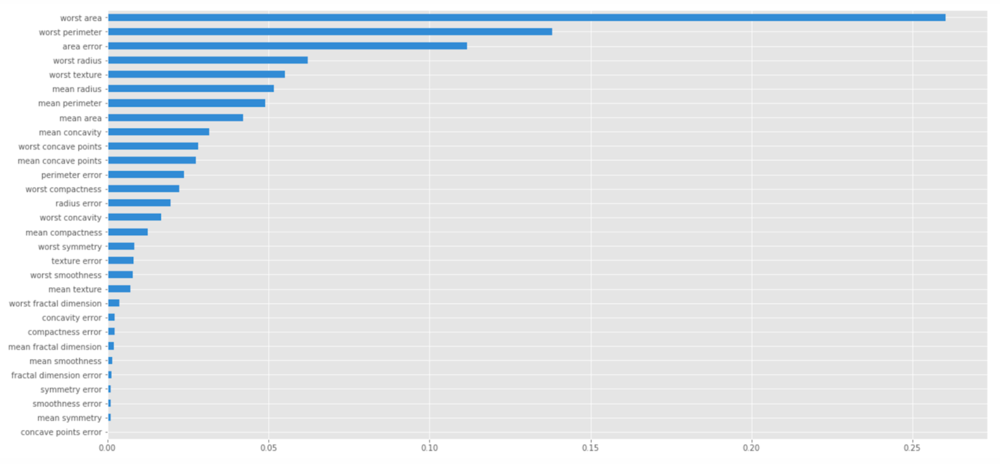

Notebook Gallery
=================

Model Abstraction
#################
.. image:: images/ml_workflow.png

InMemory Model
**************
1. https://github.com/datascienceinc/Skater/blob/master/examples/ensemble_model.ipynb
2. https://github.com/datascienceinc/Skater/blob/master/examples/image_interpretation_example.ipynb
3. https://github.com/datascienceinc/Skater/blob/master/examples/credit_analysis/Credit_Analysis.ipynb

Deployed Model
**************

1. `python` deployed model: https://github.com/datascienceinc/Skater/tree/master/examples/python-deployed-model
2. `r` deployed model: https://github.com/datascienceinc/Skater/tree/master/examples/r/deployed_model
3. pre-trained/canned model: https://github.com/datascienceinc/Skater/tree/master/examples/third_party_model

Interpretation Examples
#######################

Global Interpretation
*********************
.. image:: images/pdp.png
1. Model Agnostic Partial Dependence Plot(PDP)

    * https://github.com/datascienceinc/Skater/blob/master/examples/ensemble_model.ipynb
    * https://github.com/datascienceinc/Skater/blob/master/examples/sklearn-classifiers.ipynb
    * https://github.com/datascienceinc/Skater/blob/master/examples/sklearn_regression_models.ipynb

2. Model Agnostic Feature Importance

    * https://github.com/datascienceinc/Skater/blob/master/examples/ensemble_model.ipynb
    * https://github.com/datascienceinc/Skater/blob/master/examples/sklearn-classifiers.ipynb
    * https://github.com/datascienceinc/Skater/blob/master/examples/sklearn_regression_models.ipynb

Local Interpretation
********************
.. image:: images/lime.png
1. Local Interpretable Model Explanations(LIME)

   * https://github.com/datascienceinc/Skater/blob/master/examples/image_interpretation_example.ipynb
   * https://github.com/datascienceinc/Skater/blob/master/examples/NLP.ipynb
   * https://github.com/datascienceinc/Skater/blob/master/examples/third_party_model/algorithmia_indico.ipynb

Global And Local Interpretation
*******************************
.. image:: images/sbrl.png
1. Rule Based Models(Transparent Design)

   * https://github.com/datascienceinc/Skater/blob/master/examples/rule_list_notebooks/rule_lists_continuous_features.ipynb
   * https://github.com/datascienceinc/Skater/blob/master/examples/rule_list_notebooks/rule_lists_titanic_dataset.ipynb

